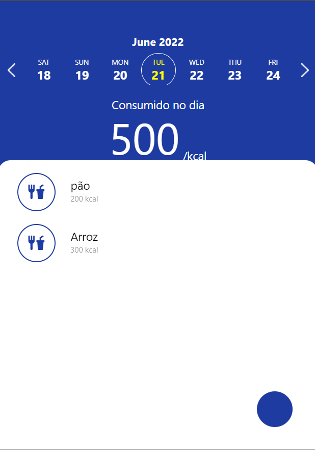

<p align="center">
  <h1 align="center">
    AppMyFit 🥗:balance_scale:🥩
  </h1>
</p>

## 📑 Sobre o projeto

Aplicação para calcular calorias diárias

## 🎨 Layout



## 🔍 Tecnologias

- React

## 🔌 Como executar

Antes de executar, rode o comando:

```
npm install yet
```

em seguida rode o seguinte comando:

```
npm run start
```

escolha  a versão WEB clicando a tecla `w`